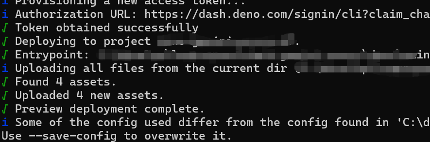

# Deno Gemini 프록시

Deno 기반의 Gemini API 프록시 서비스입니다. Deno Deploy 플랫폼에 배포할 수 있습니다.

## 주요 기능

- Gemini API 요청을 Google 공식 API로 전달합니다.
- 상태 확인(health check) 엔드포인트를 제공합니다.
- 모든 Gemini API 엔드포인트를 지원합니다.

## 로컬 개발

### 사전 요구 사항

Deno가 설치되어 있는지 확인해 주세요.

```bash
# Linux/macOS에서 Deno 설치하기
curl -fsSL https://deno.land/install.sh | sh

# Windows에서 Deno 설치하기 (PowerShell 사용)
irm https://deno.land/install.ps1 | iex
```

### 서비스 실행

```bash
deno run --allow-net  main.ts
```

서비스는 http://localhost:8000에서 시작됩니다.

### 엔드포인트 테스트

```bash
# 상태 확인 테스트
curl http://localhost:8000/health

# API 전달 테스트 (유효한 API 키가 필요합니다)
curl -X POST http://localhost:8000/v1beta/models/gemini-2.5-flash:generateContent \
  -H "Content-Type: application/json" \
  -H "x-goog-api-key: YOUR_API_KEY" \
  -d '{"contents":[{"parts":[{"text":"Hello"}]}]}'
```

## Deno Deploy에 배포하기

### 방법 1: deployctl CLI 사용

1. `deployctl`을 설치해 주세요:
```bash
deno install -gArf jsr:@deno/deployctl
```
2. 이 프로젝트가 있는 `deno` 폴더로 이동해 주세요.
3. 배포 스크립트를 실행해 주세요 (deployctl의 환경 변수 추가를 잊지 마세요).
```bash
deployctl deploy
```
4. 성공적으로 완료되면, 다음과 같은 결과를 볼 수 있습니다.
 


### 방법 2: GitHub 연동을 통한 배포

1. 코드를 GitHub 저장소로 푸시해 주세요.
2. [Deno Deploy](https://dash.deno.com/)에 방문해 주세요.
3. 새 프로젝트를 생성해 주세요.
4. GitHub 저장소를 연결해 주세요.
5. 진입점(entry point) 파일을 `main.ts`로 설정해 주세요.
6. 배포가 완료됩니다.


## 사용 방법

배포가 완료되면, `https://your-project.deno.dev`와 같은 URL을 받게 됩니다.
이 URL을 사용자의 `Gemini-Api-key-Aggregator` 설정에 추가하면 됩니다.

## 라이선스

MIT License